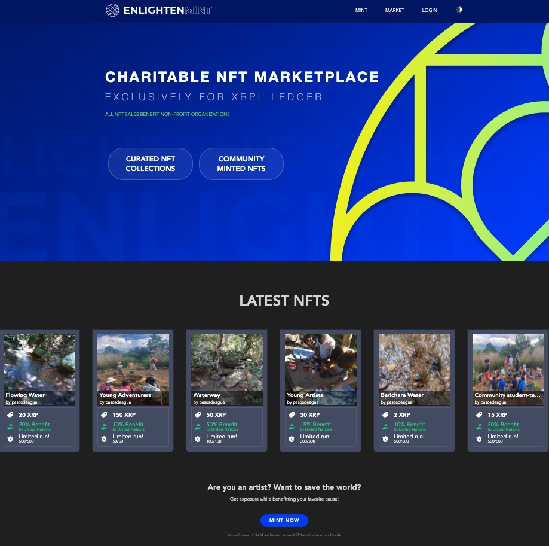

# EnlightenMint
## Charitable NFT marketplace

**EnlightenMint** is a Charitable NFT marketplace developed exclusively for XRPL Ledger

You can mint NFTs that will benefit charitable organizations around the world that help the most humanitarian goals. If you are an artist that wants to save the world you can get exposure while benefitting your favorite cause.

Check it out at [EnlightenMint](https://nftmarket-kuyawa.vercel.app)

Developed with NodeJS, Next, React, Prisma and MongoDB it uses [https://github.com/kuyawa/nftdatabase](https://github.com/kuyawa/nftdatabase) as database

@2022 EnlightenMint - All rights reserved